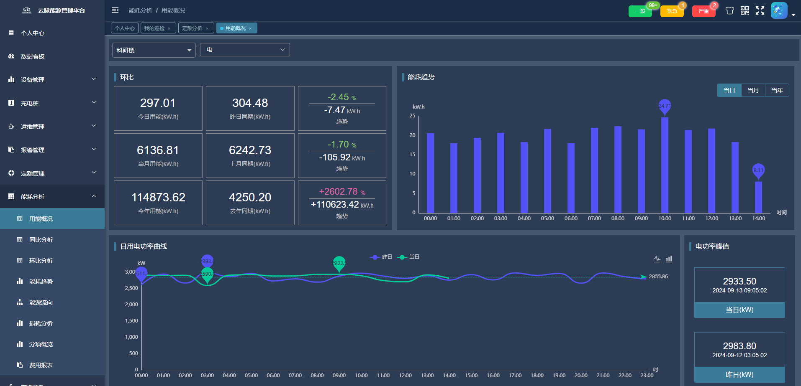

# cp-ems-ruoyi

#### 介绍
本项目是基于ruoyi开发的能源管理系统（EMS），权限部分沿用了框架自带的体系，其余功能为定制开发，UI样式做了改造。  
系统提供了能耗分析、定额管理、运维管理等功能，满足用户对能耗数据的监控和管理，个人和企业均可免费自用。  

#### 软件架构
前端框架：vue2 + element-ui + ECharts        
后端框架：SpringBoot + Mysql + TDengine + Redis + RabbitMq + MQTT 

#### 在线体验
演示地址： https://www.szcloudpulse.com:86   
体验账号： EMSUser/123456

#### 主要功能
完整功能请登录系统查看
    
0. 数据采集 - 支持MQTT通信
1. 设备管理 - 设备、网关台账
2. 运维管理 - 巡检计划、维修工单等
3. 能耗分析 - 能耗概览、同比环比数据、能耗趋势、分项概况等
4. 报警管理 - 实时报警、历史报警、报警规则配置等
5. 定额管理 - 定额配置、用量监测等
6. 系统管理 - 用户、权限、日志、系统监控等
7. 其它功能
    * 碳资产管理
    * 能耗分析报告
    * 管理体系管理
    * 视频监控
8. 充电桩应用场景
    * 订单管理
    * 电站、电桩管理
    * 价格策略配置
9. 数据看板  

#### 本地运行
https://www.szcloudpulse.com/run-document.html

#### 界面截图
 
 
 
  

支持深浅两种主题，浅色效果    
  

#### 配套小程序体验
* 支持查看平台能耗数据
* 支持查看报警记录
* 支持处理巡检、维修工单  

扫码体验   
 

小程序界面  
 
 
 
 

#### 技术交流&获取使用说明  
公众号上有更多案例  
“云脉软件”公众号  
  

咨询交流请加微信  
 

#### 关于我们
苏州云脉软件技术有限公司  
<a href='https://www.szcloudpulse.com' target='_blank'>www.szcloudpulse.com</a>

#### 其他开源项目  
云脉生产管理系统
本项目是基于ruoyi开发的生产工单管理系统（mes），权限部分沿用了框架自带的体系，其余功能为定制开发，UI样式做了改造。 
<a href='https://gitee.com/cloudpulse/cp-mes-ruoyi' target='_blank'>https://gitee.com/cloudpulse/cp-mes-ruoyi</a>
 
